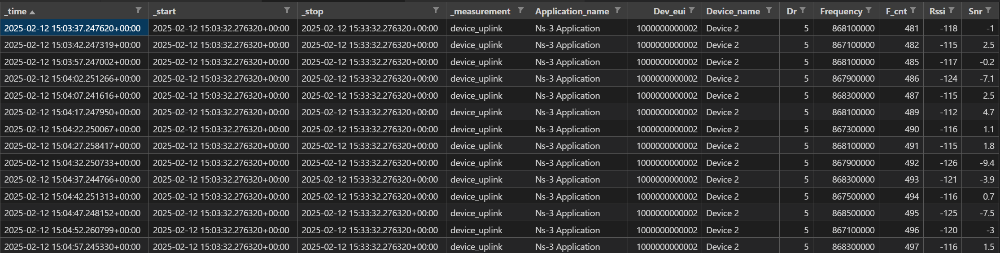

# Config server example high level API overview

In our testbed implementation, the *Config Server* is a function in charge of (i) evaluating the state of the network, (ii) taking decisions according to some logic, and (iii) accordingly serving device configurations to the LoRaWAN Network Server (LNS). Once set, the LNS stores these configurations and applies them to the device when a reconfiguration chance is possible. It is important to understand that the LNS does ***not*** store a queue of configurations to be applied, but a desired configuration *state*. This means that the LNS will keep sending configurations until the device acknowledges that it is aligned with them.

In LoRaWAN, most devices (see, Class A) provide a configuration chance only after one of their uplink messages is received. After receiving an uplink packet from a device, the LNS checks for discrepancies between the known device status and their desired configuration state, produces a downlink configuration message, and sends it to the device. The time window before the downlink process starts is actually enough for the Config Server to be notified of the new uplink message and to apply a change to the configurations to be sent shortly thereafter.

In the following, we detail the API signatures available in the Config Server to implement custom behavior.

## Retieve historical traffic data and build aggregate performance metrics

To evaluate the state of the network, the Config Server can retrieve metrics of historical traffic data from a telemetry layer database.

To get metadata of the past uplink transmission for a device, we provide a function with the following signature:

- `get_uplink_records(dev_eui: str, start: str, stop: str = "now()") -> pandas.DataFrame`:

    Get DataFrame cointaining database records on uplink frames for a device.

    Arguments:

  - `dev_eui`: EUI identifier of a device we want to query data of.
  - `start`: Start time of the time windows of data to be retrieved. Can be relative duration, absolute time, or integer (Unix timestamp in seconds). For example, "-1h", "2019-08-28T22:00:00Z", or "1567029600".
  - `stop` (optional): See start for possible values. Defaults to "now()".

Internally, the function sends a [Flux query](https://docs.influxdata.com/flux/v0/) to the database and does some minor processing on the output.

The [output dataframe](assets/uplink_events.csv) will look like this:



All entries are already sorted by `_time`. DataFrame fields explanation:

- `_time` (`numpy.datetime64[ns, UTC]`, index): Timestamp of reception at the telemetry layer
- `_start`/`_stop` (`numpy.datetime64[ns, UTC]`): Begin/end timestamp of the queried time window of this dataset (same for all records)
- `_measurement` (`str`): Internal record type tag of the telemetry layer (same for all records)
- `application_name` (`str`): LNS application tag for this device (same for all records)
- `dev_eui` (`str`): LoRaWAN DevEUI of the source device (same for all records)
- `device_name` (`str`): Name assigned to the source device in the LNS (same for all records)
- `dr` (`str`): LoRaWAN data rate setting used for the transmission of this uplink message
- `frequency` (`str`): Channel frequency [Hz] used the transmission of this uplink message
- `f_cnt` (`numpy.int64`): LoRaWAN frame counter of this uplink message
- `rssi` (`numpy.int64`): Received Signal Strenght Indicator (RSSI) [dBm] measured during the reception of this uplink message
- `snr` (`numpy.float64`): Signal to Noise Ratio (SNR) [dB] measured during the reception of this uplink message

The Config Server can use this data to produce aggregated metrics to be used in the decision making process. See the [section](#example-code) below for an example computing the Packet Delivery Ratio (PDR).

## Interact with device configurations stored in the LNS

For the time being, the set of configurations that can be applied to devices is limited to the Channel Mask. The Channel Mask configuration (ChMask in LoRaWAN's specifications) controls the set of active channels that a device can use for uplink transmissions among the ones installed on the device itself. It is implemented as a list of channel indices, as for example `chmask = [0, 5, 7]`. As a consequence, before sending a configuration, one might want to check whether the desired channels are known/installed in the device. For this reason, the API also provides tools to retrieve this information from the LNS.

### High level ChMask configuration primitives

In the following we detail the high level API signatures to interact with the devices' ChMask configuration in the LNS:

- `is_chmask_compatible(self, chmask: list[int], dev_eui: str) -> bool`:

    Check whether the provided ChMask is compatible with the channels currently installed on the device. Returns false if any of the provided channel indices are not among the ones available to the device yet. This is mostly a developer check, as devices will ignore any unknown channel set to active. This primitive will throw an exception if the device doesn't exist or has not been activated.

- `set_chmask_for_device(self, chmask: list[int], dev_eui: str) -> None`:

    Set the provided ChMask configuration for the device. This primitive either creates or updates configurations for the device on the LNS. It raises an exception if device doesn't exist. Mind that if the device exists but has not been activated, the LNS will still not send any downlink reconfigurations to it even if you set them.

- `is_device_chmask_aligned(self, dev_eui: str) -> bool`:

    Get the alignment status for device's ChMask configurations stored on the LNS. Defaults to true if no configuration store is found for the device on the LNS. It raises an exception if device doesn't exist or has not been activated.

### Other LNS API primitives

The underlying gRPC API uses lower level functions and structures (e.g. `api.DeviceConfigStore`) that are described [here](https://github.com/non-det-alle/chirpstack/blob/config-store/api/proto/api/device_config_store.proto). We also provide some additional wrapper functions that align more closely to the underling LNS gRPC API used to manage the whole set of device configurations you can store in the LNS:

- `set_device_config(self, config_store: api.DeviceConfigStore) -> None`:

    Set the provided configuration store for the device. This primitive either creates or updates configurations for the device on the LNS. It raises an exception if device doesn't exist. Mind that if the device exists but has not been activated, the LNS will still not send any downlink reconfigurations to it even if you set them.

- `get_device_config(self, dev_eui: str) -> api.DeviceConfigStore | None`:

    Get the configuration store of a device, if it exists. This function does not raise exceptions if the device does not exists.

- `delete_device_config(self, dev_eui: str) -> None`:

    Delete the configuration store of a device. This function does not raise exceptions if the configuration store is already absent or the device does not exists.

- `list_configured_devices(self, application_id: str) -> list[str]`:

    For an application, fetch the list of EUI identifiers for all devices having a configuration store.

- `get_device_config_alignment(self, dev_eui: str) -> api.ConfigStoreAlignment`:

    Get the alignment state of configurations stored for a device. Defaults everything to true if the configuration store is missing, if the device does not exist or the device has not been activated.

- `get_device_available_uplink_channels(self, chmask: list[int], dev_eui: str) -> list[int]`:

    Get a list of channel indices that the LNS knows are currently installed onto the device. It raises an exception if device doesn't exist or has not been activated.

## Example code

The following code excerpt represent the core logic of the example config-store function implemented in [start.py](../config-server/src/start.py). It is executed on signal reception from the LNS MQTT broker (see line 2.a from the [README file](../README.md)).

```py
# this is what's called when an uplink is detected
def on_uplink(mqtt_client: mqtt.Client, userdata, message: mqtt.MQTTMessage):
    print(f"\n\n{message.topic}")
    uplink_event = Parse(message.payload, UplinkEvent())
    dev_eui = uplink_event.device_info.dev_eui

    ##############################################
    # Making use of the data collection pipeline #
    ##############################################
    try:
        uplink_records = db_client.get_uplink_records(dev_eui, f"-{history}")
    except ValueError as e:
        print(f"{e} Postponed.")
        return
    # Time series of frame counters
    f_cnts = uplink_records["f_cnt"].astype(int)
    # Add latest record if missing
    if f_cnts.iat[-1] != uplink_event.f_cnt:
        # avoid gw reception time (uplink_event.time), it can mess up order
        f_cnts[pd.Timestamp.now("UTC")] = uplink_event.f_cnt
        f_cnts = f_cnts.sort_index()
    # Compute Packet Delivery Ratio (PDR)
    recv = f_cnts.count()
    sent = f_cnts.diff()
    # Manage f_cnt resets
    sent = sent.mask(sent < 0, None).fillna(1).sum()
    pdr = recv / sent
    print(f"PDR of past {history}: {pdr} ({recv}/{int(sent)})")

    ####################################################
    # Giving ChirpStack configs for the LoRaWAN device #
    ####################################################
    # (Example: Restrict the number of channels if PDR is >70%)
    chmask = reduced_chmask if pdr >= 0.7 else list(range(8))
    # Log current device configuration aligment
    _ = cs_client.get_device_config_alignment(dev_eui)
    # Check compatibility with installed channels
    if not cs_client.is_chmask_compatible(chmask, dev_eui):
        print(f"Configuration not compatible (chmask: {chmask})")
        return
    # Set chmask
    time.sleep(2)  # comment out for immediate chmask configuration
    # Set chmask
    cs_client.set_chmask_for_device(chmask, dev_eui)
```
